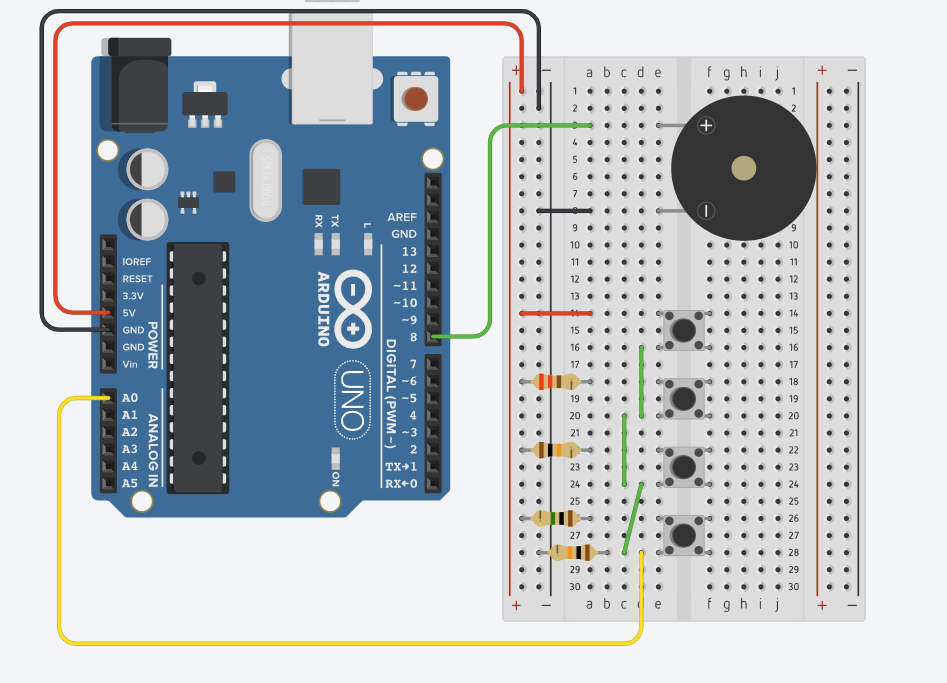

# Keyboard Instrument

Arduino project that turns a resistor-ladder button circuit into a simple musical keyboard. Each button plays a different note through a passive buzzer.

## Hardware

| Component | Pin |
|-----------|-----|
| Resistor ladder (4 buttons) | A0 |
| Passive buzzer | D8 |

## Schematic

## Notes

| Button | Note | Frequency |
|--------|------|-----------|
| 1 | C4 (Do) | 262 Hz |
| 2 | D4 (Re) | 294 Hz |
| 3 | E4 (Mi) | 330 Hz |
| 4 | F4 (Fa) | 349 Hz |

## Usage

Upload the firmware, connect the circuit, and press any button to play its corresponding note. The serial monitor (9600 baud) prints the raw analog value read from A0.

