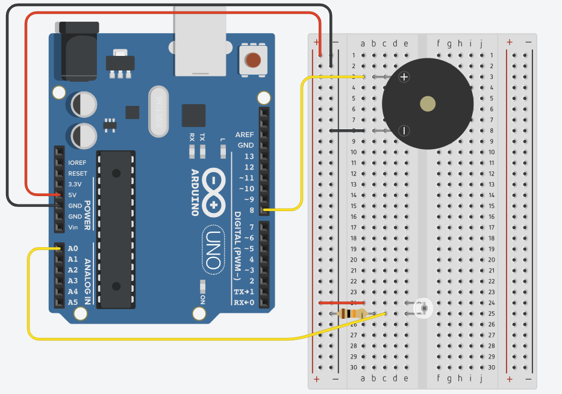

# Light Theremin

An Arduino-based theremin that uses a phototransistor to control pitch — cover or expose the sensor to play different tones through a piezo buzzer.

## How It Works

On startup, the Arduino runs a **5-second calibration phase** where it samples the phototransistor continuously to record the minimum and maximum light levels in the environment. The onboard LED (pin 13) stays on during this window as a visual cue.

Once calibration ends, the main loop reads the current light level and maps it to a frequency between **50 Hz and 4000 Hz**, which is sent to the piezo buzzer via `tone()`. More light → higher pitch. Less light → lower pitch.

## Components

| Component        | Pin  |
|-----------------|------|
| Phototransistor  | A0   |
| Piezo buzzer     | D8   |
| Onboard LED      | D13  |

## Schematic

## Usage

1. Upload the sketch to your Arduino.
2. Point the phototransistor toward a light source and wait **5 seconds** for calibration (LED on = calibrating).
3. Once the LED turns off, wave your hand over the sensor to change the pitch.
## Notes

- Calibration quality depends on the ambient light range during the 5-second window. Try to vary the light exposure (cover and uncover the sensor) during calibration for a wider dynamic range.
- The ADC resolution is set to **12-bit** (`analogReadResolution(12)`), so sensor values range from 0–4095. This requires a board that supports 12-bit ADC (e.g., Arduino R4, MKR series, or Due).
- Tone duration is set to 20 ms with a 10 ms loop delay, producing a continuous-sounding output.
## Tech Stack

- **Platform:** Arduino (12-bit ADC required)
- **Language:** C++ / Arduino framework
- **IDE:** PlatformIO
