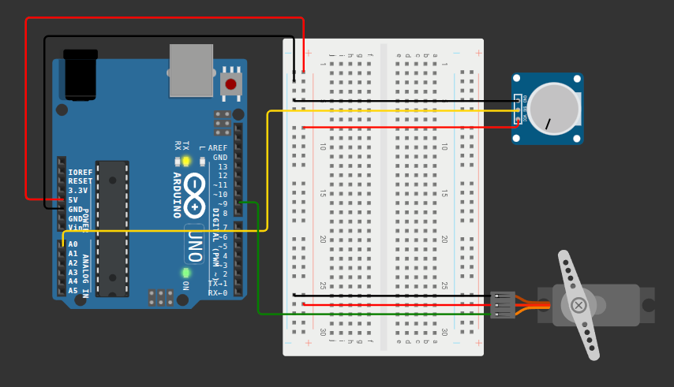

# Mood Cue

A servo motor controlled by a potentiometer. Rotating the potentiometer moves the servo to a corresponding angle in real time.

> **Note:** This project covers the servo motor portion of the Mood Cue exercise from the Arduino Starter Kit book.

## Components

- Arduino UNO R4 WiFi
- Servo motor
- Capacitors (100µF)
- Potentiometer
- Breadboard
- Jumper wires
## Circuit Diagram

> Diagram built with Wokwi using the Arduino UNO. Connections are identical for the UNO R4 WiFi.

## How It Works

The potentiometer outputs an analog voltage that the Arduino reads on pin `A0`. That value is mapped from the 12-bit ADC range (0–4095) to a servo angle (0–179°), which is then written to the servo on pin `9` via PWM signal.

## Wiring

| Component      | Pin        | Arduino Pin |
|----------------|------------|-------------|
| Potentiometer  | Wiper      | A0          |
| Potentiometer  | Terminal 1 | GND         |
| Potentiometer  | Terminal 2 | 5V          |
| Servo          | Signal     | 9 (PWM)     |
| Servo          | VCC        | 5V          |
| Servo          | GND        | GND         |

## Notes

- `analogReadResolution(12)` is specific to the UNO R4 WiFi, which supports a 12-bit ADC (0–4095). Standard UNO boards use 10-bit resolution (0–1023).
- The `Servo` library must be added to `platformio.ini` under `lib_deps` when using PlatformIO.
- A 100µF electrolytic capacitor between the servo's VCC and GND is recommended to smooth out current spikes when the motor moves. It was not included in the Wokwi diagram due to component limitations.